# Especificación: Persistencia de Progreso y Flujo Secuencial

## Objetivo

Permitir que los consultores puedan:
1. **Pausar y continuar** - Si no terminan un agente en una sesión, pueden continuar después sin perder progreso
2. **Flujo secuencial** - Los agentes se desbloquean en orden (1→2→3→4→5→6→7)
3. **Invalidación en cascada** - Si editan un agente anterior, los siguientes se invalidan

## 1. Persistencia de Progreso

### ¿Cómo se Guarda el Progreso?

Cada vez que el usuario responde una pregunta al agente, el **estado completo** se guarda en la base de datos.

#### Tabla: `stages`

```sql
CREATE TABLE stages (
  id UUID PRIMARY KEY DEFAULT gen_random_uuid(),
  account_id UUID NOT NULL REFERENCES accounts(id) ON DELETE CASCADE,
  stage_number INTEGER NOT NULL CHECK (stage_number BETWEEN 1 AND 7),
  status VARCHAR(50) NOT NULL DEFAULT 'locked',
  state JSONB DEFAULT '{}',  -- ← AQUÍ SE GUARDA EL PROGRESO
  output JSONB,
  ai_model_used VARCHAR(50),
  created_at TIMESTAMP DEFAULT CURRENT_TIMESTAMP,
  updated_at TIMESTAMP DEFAULT CURRENT_TIMESTAMP,
  completed_at TIMESTAMP,

  UNIQUE(account_id, stage_number)
);
```

#### Campo `state` (JSONB)

El campo `state` contiene **todo** el progreso actual del agente:

```json
{
  "currentPhase": "company_context",
  "currentStep": 3,
  "totalSteps": 28,
  "collectedData": {
    "industry": "SaaS B2B",
    "company_size": "50-200 empleados",
    "target_market": "Startups tecnológicas",
    // ... todas las respuestas recopiladas hasta ahora
  }
}
```

#### Campo `status` (VARCHAR)

Posibles valores:
- **`locked`** - El agente está bloqueado (agentes anteriores no completados)
- **`in_progress`** - El usuario está actualmente trabajando en este agente
- **`completed`** - El agente fue completado, hay output disponible

### Flujo de Guardado


### Recuperación del Progreso

Cuando el usuario regresa días después:

```python
# /backend/app/routers/agents.py

@router.post("/agents/{stage_id}/chat")
async def chat_with_agent(
    stage_id: str,
    message: ChatMessage,
    current_user: User = Depends(get_current_user),
    db: AsyncSession = Depends(get_db)
):
    # 1. Obtener stage de la BD
    stage = await db.get(Stage, stage_id)

    # 2. El estado previo está en stage.state
    previous_state = stage.state or {}

    # 3. Construir prompt con el estado previo
    context = {
        "accountContext": {
            "consultantName": account.consultant_name,
            "companyName": account.client_name,
            "companyWebsite": account.company_website
        },
        "previousState": previous_state,  # ← AQUÍ ESTÁ EL PROGRESO
        "userMessage": message.content
    }

    # 4. Llamar al agente
    response = await ai_service.chat_with_agent(
        stage_number=stage.stage_number,
        context=context
    )

    # 5. Guardar nuevo estado
    stage.state = response["updatedState"]
    stage.updated_at = datetime.now()
    await db.commit()

    return response
```

### Ejemplo: Usuario Pausando y Continuando

#### Sesión 1 (Lunes 10:00 AM):

```
Usuario: Responde preguntas 1-5 del Agente 1
Backend: Guarda state con collectedData = { q1, q2, q3, q4, q5 }
Usuario: Cierra navegador
```

**En la BD:**
```json
{
  "id": "stage-123",
  "status": "in_progress",
  "state": {
    "currentPhase": "customer_intelligence",
    "currentStep": 5,
    "totalSteps": 28,
    "collectedData": {
      "industry": "SaaS B2B",
      "company_size": "50-200",
      "target_market": "Startups",
      "revenue_range": "$1M-$5M",
      "growth_stage": "Expansion"
    }
  }
}
```

#### Sesión 2 (Miércoles 3:00 PM):

```
Usuario: Abre BOOMS, va a la cuenta
Frontend: GET /api/accounts/{accountId}/stages
Backend: Retorna stages con state guardado
Frontend: Muestra "Continuar desde pregunta 6"
Usuario: Click en "Continuar"
Backend: Construye prompt con state anterior
Agente: "Retomando... Pregunta 6: ¿Cuáles son los principales pain points?"
```

El agente **no vuelve a hacer preguntas 1-5** porque están en `collectedData`.

## 2. Flujo Secuencial de Agentes

### Regla de Desbloqueo

```
Agente N se desbloquea SOLO si Agente N-1 está completed
```

#### Estados Iniciales (Nueva Cuenta):

| Agente | Status |
|--------|--------|
| 1. Booms | `in_progress` ✅ |
| 2. Journey | `locked` 🔒 |
| 3. Ofertas | `locked` 🔒 |
| 4. Canales | `locked` 🔒 |
| 5. Atlas | `locked` 🔒 |
| 6. Planner | `locked` 🔒 |
| 7. Budgets | `locked` 🔒 |

#### Después de completar Agente 1:

| Agente | Status |
|--------|--------|
| 1. Booms | `completed` ✅ |
| 2. Journey | `in_progress` ✅ (desbloqueado) |
| 3. Ofertas | `locked` 🔒 |
| 4. Canales | `locked` 🔒 |
| 5. Atlas | `locked` 🔒 |
| 6. Planner | `locked` 🔒 |
| 7. Budgets | `locked` 🔒 |

#### Después de completar Agente 2:

| Agente | Status |
|--------|--------|
| 1. Booms | `completed` ✅ |
| 2. Journey | `completed` ✅ |
| 3. Ofertas | `in_progress` ✅ (desbloqueado) |
| 4. Canales | `locked` 🔒 |
| 5. Atlas | `locked` 🔒 |
| 6. Planner | `locked` 🔒 |
| 7. Budgets | `locked` 🔒 |

### Implementación del Desbloqueo

```python
# /backend/app/services/stage_service.py

from sqlalchemy import select, update
from sqlalchemy.ext.asyncio import AsyncSession

async def complete_stage(stage_id: str, output: dict, db: AsyncSession):
    """Marca un stage como completado y desbloquea el siguiente"""

    # 1. Marcar stage actual como completed
    stage = await db.get(Stage, stage_id)
    stage.status = "completed"
    stage.output = output
    stage.completed_at = datetime.now()
    stage.state = {}  # Limpiar state (ya no se necesita)

    await db.commit()

    # 2. Desbloquear siguiente stage (si existe)
    next_stage_number = stage.stage_number + 1

    if next_stage_number <= 7:
        # Buscar el siguiente stage
        result = await db.execute(
            select(Stage)
            .where(Stage.account_id == stage.account_id)
            .where(Stage.stage_number == next_stage_number)
        )
        next_stage = result.scalar_one_or_none()

        if next_stage:
            # Desbloquear
            next_stage.status = "in_progress"
            next_stage.state = {}  # Inicializar estado vacío
            await db.commit()

    return stage
```

### Frontend: Vista de Pipeline

El frontend muestra el estado de cada agente visualmente:

```typescript
// /frontend/src/components/pipeline/PipelineView.tsx

import { Lock, CheckCircle, Play } from 'lucide-react';

interface Stage {
  id: string;
  stageNumber: number;
  status: 'locked' | 'in_progress' | 'completed';
  name: string;
}

export function PipelineView({ stages }: { stages: Stage[] }) {
  return (
    <div className="flex flex-col gap-4">
      {stages.map((stage) => (
        <div
          key={stage.id}
          className={`
            p-6 rounded-lg border-2
            ${stage.status === 'completed' ? 'bg-green-50 border-green-500' : ''}
            ${stage.status === 'in_progress' ? 'bg-blue-50 border-blue-500' : ''}
            ${stage.status === 'locked' ? 'bg-gray-50 border-gray-300 opacity-50' : ''}
          `}
        >
          <div className="flex items-center justify-between">
            <div className="flex items-center gap-4">
              {/* Icono según estado */}
              {stage.status === 'completed' && (
                <CheckCircle className="w-8 h-8 text-green-500" />
              )}
              {stage.status === 'in_progress' && (
                <Play className="w-8 h-8 text-blue-500" />
              )}
              {stage.status === 'locked' && (
                <Lock className="w-8 h-8 text-gray-400" />
              )}

              <div>
                <h3 className="text-lg font-semibold">
                  Agente {stage.stageNumber}: {stage.name}
                </h3>
                <p className="text-sm text-gray-600">
                  {stage.status === 'completed' && 'Completado ✓'}
                  {stage.status === 'in_progress' && 'En progreso...'}
                  {stage.status === 'locked' && 'Bloqueado - Completa agentes anteriores'}
                </p>
              </div>
            </div>

            {/* Botones de acción */}
            {stage.status === 'in_progress' && (
              <Button onClick={() => navigateToAgent(stage.id)}>
                Continuar
              </Button>
            )}

            {stage.status === 'completed' && (
              <div className="flex gap-2">
                <Button variant="outline" onClick={() => viewOutput(stage.id)}>
                  Ver Resultado
                </Button>
                <Button variant="ghost" onClick={() => editStage(stage.id)}>
                  Editar
                </Button>
              </div>
            )}
          </div>

          {/* Barra de progreso para in_progress */}
          {stage.status === 'in_progress' && stage.state?.progress && (
            <div className="mt-4">
              <div className="w-full bg-gray-200 rounded-full h-2">
                <div
                  className="bg-blue-500 h-2 rounded-full transition-all"
                  style={{ width: `${stage.state.progress}%` }}
                />
              </div>
              <p className="text-xs text-gray-600 mt-1">
                Progreso: {stage.state.progress}%
              </p>
            </div>
          )}
        </div>
      ))}
    </div>
  );
}
```

## 3. Invalidación en Cascada

### Problema

Si el usuario edita el **Agente 1** después de completar los Agentes 1-5, los agentes 2-5 ahora tienen información desactualizada.

**Solución:** Al editar un agente, invalidar todos los agentes posteriores.

### Regla de Invalidación

```
Al editar Agente N:
  - Agentes N+1 hasta 7 → status = 'locked'
  - Agentes N+1 hasta 7 → output = NULL
  - Agentes N+1 hasta 7 → state = {}
```

### Implementación

```python
# /backend/app/services/stage_service.py

async def edit_stage(stage_id: str, db: AsyncSession):
    """Permite editar un stage completado e invalida stages posteriores"""

    stage = await db.get(Stage, stage_id)

    if stage.status != "completed":
        raise ValueError("Solo se pueden editar stages completados")

    # 1. Resetear stage actual a in_progress
    stage.status = "in_progress"
    stage.output = None
    stage.state = {}
    stage.completed_at = None

    # 2. Invalidar todos los stages posteriores
    result = await db.execute(
        select(Stage)
        .where(Stage.account_id == stage.account_id)
        .where(Stage.stage_number > stage.stage_number)
    )
    subsequent_stages = result.scalars().all()

    for subsequent_stage in subsequent_stages:
        subsequent_stage.status = "locked"
        subsequent_stage.output = None
        subsequent_stage.state = {}
        subsequent_stage.completed_at = None

    await db.commit()

    return {
        "message": f"Stage {stage.stage_number} reabierto para edición",
        "invalidated_stages": [s.stage_number for s in subsequent_stages]
    }
```

### Endpoint

```python
# /backend/app/routers/stages.py

@router.post("/stages/{stage_id}/edit")
async def edit_stage(
    stage_id: str,
    current_user: User = Depends(get_current_user),
    db: AsyncSession = Depends(get_db)
):
    """Permite editar un stage completado (invalida stages posteriores)"""

    # Verificar ownership
    stage = await db.get(Stage, stage_id)
    account = await db.get(Account, stage.account_id)

    if account.user_id != current_user.id:
        raise HTTPException(status_code=403, detail="No autorizado")

    result = await stage_service.edit_stage(stage_id, db)

    return result
```

### Frontend: Confirmación antes de Editar

```typescript
// /frontend/src/components/stage/EditStageButton.tsx

import { AlertDialog } from '@/components/ui/alert-dialog';
import { Button } from '@/components/ui/button';

export function EditStageButton({ stageId, stageNumber }: { stageId: string, stageNumber: number }) {
  const [showConfirm, setShowConfirm] = useState(false);

  const handleEdit = async () => {
    try {
      const response = await axios.post(
        `${API_URL}/stages/${stageId}/edit`,
        {},
        { headers: { Authorization: `Bearer ${token}` } }
      );

      // Mostrar qué stages fueron invalidados
      const invalidated = response.data.invalidated_stages;

      if (invalidated.length > 0) {
        alert(
          `⚠️ Los siguientes agentes fueron invalidados y deberás completarlos nuevamente:\n` +
          `Agentes: ${invalidated.join(', ')}`
        );
      }

      // Redirigir a la vista del agente
      navigate(`/agents/${stageId}`);

    } catch (error) {
      console.error('Error editando stage:', error);
      alert('Error al editar stage');
    }
  };

  return (
    <>
      <Button variant="ghost" onClick={() => setShowConfirm(true)}>
        Editar
      </Button>

      <AlertDialog open={showConfirm} onOpenChange={setShowConfirm}>
        <AlertDialogContent>
          <AlertDialogTitle>¿Editar Agente {stageNumber}?</AlertDialogTitle>
          <AlertDialogDescription>
            Al editar este agente, todos los agentes posteriores (Agentes {stageNumber + 1}-7)
            serán invalidados y deberás completarlos nuevamente.

            ¿Estás seguro de continuar?
          </AlertDialogDescription>
          <AlertDialogFooter>
            <Button variant="outline" onClick={() => setShowConfirm(false)}>
              Cancelar
            </Button>
            <Button variant="destructive" onClick={handleEdit}>
              Sí, Editar
            </Button>
          </AlertDialogFooter>
        </AlertDialogContent>
      </AlertDialog>
    </>
  );
}
```

## 4. Ejemplo Completo de Flujo

### Escenario: Consultor María trabajando en Cliente "TechCorp"

#### Día 1 (Lunes 10:00 AM):
```
1. María crea cuenta "TechCorp"
2. Backend crea 7 stages:
   - Stage 1: status = "in_progress"
   - Stages 2-7: status = "locked"

3. María inicia Agente 1 (Booms)
4. Responde preguntas 1-10
5. Backend guarda state después de cada pregunta
6. María cierra el navegador
```

**En BD:**
```json
{
  "stage_1": {
    "status": "in_progress",
    "state": {
      "currentStep": 10,
      "totalSteps": 28,
      "collectedData": { "q1": "...", "q2": "...", ... "q10": "..." }
    }
  }
}
```

#### Día 2 (Martes 2:00 PM):
```
1. María vuelve a BOOMS
2. Ve cuenta "TechCorp"
3. Click en "Continuar Agente 1"
4. Backend carga state guardado
5. Agente continúa desde pregunta 11
6. María completa las 28 preguntas
7. Backend:
   - stage_1.status = "completed"
   - stage_1.output = { buyerPersona: ..., scalingUpTable: ... }
   - stage_2.status = "in_progress" (desbloqueado)
8. María descarga PDF y Excel del Agente 1
```

#### Día 3 (Miércoles 11:00 AM):
```
1. María inicia Agente 2 (Journey)
2. Responde 8 de 12 preguntas
3. Pausa para almorzar
```

**En BD:**
```json
{
  "stage_2": {
    "status": "in_progress",
    "state": {
      "currentStep": 8,
      "totalSteps": 12,
      "collectedData": { "q1": "...", ... "q8": "..." }
    }
  }
}
```

#### Día 3 (Miércoles 3:00 PM):
```
1. María regresa
2. Continúa Agente 2 desde pregunta 9
3. Completa Agente 2
4. Backend:
   - stage_2.status = "completed"
   - stage_2.output = { journeyTable: ..., narrative: ... }
   - stage_3.status = "in_progress" (desbloqueado)
5. María descarga PDF y Excel del Agente 2
```

#### Día 5 (Viernes):
```
1. María revisa output del Agente 1
2. Se da cuenta que quiere cambiar el buyer persona
3. Click en "Editar Agente 1"
4. Sistema muestra: "⚠️ Esto invalidará Agentes 2-3"
5. María confirma
6. Backend:
   - stage_1.status = "in_progress"
   - stage_1.output = NULL
   - stage_2.status = "locked" (invalidado)
   - stage_2.output = NULL
   - stage_3.status = "locked"
7. María re-hace Agente 1
8. Completa Agente 1 (nuevo output)
9. Agente 2 se desbloquea
10. María re-hace Agente 2 con nuevo contexto
```

## 5. Diagrama de Estados

```mermaid
stateDiagram-v2
    [*] --> locked: Nueva cuenta (stages 2-7)
    [*] --> in_progress: Nueva cuenta (stage 1)

    locked --> in_progress: Agente anterior completado
    in_progress --> completed: Usuario completa todas preguntas
    completed --> in_progress: Usuario edita (invalidación)

    completed --> [*]: Cuenta completada
```



## Resumen

### ✅ Persistencia de Progreso

- **Automática**: Cada respuesta se guarda en `stages.state`
- **Sin pérdida**: El usuario puede cerrar y volver días después
- **Granular**: Se guarda paso a paso, no solo al finalizar

### ✅ Flujo Secuencial

- **Desbloqueo en orden**: 1→2→3→4→5→6→7
- **Estado visual**: El pipeline muestra qué está bloqueado/disponible
- **Progreso visible**: Barra de progreso por agente

### ✅ Invalidación Inteligente

- **Edición permitida**: Puedes volver atrás y cambiar
- **Cascada automática**: Al editar N, invalida N+1 hasta 7
- **Confirmación**: El usuario sabe qué perderá antes de editar
